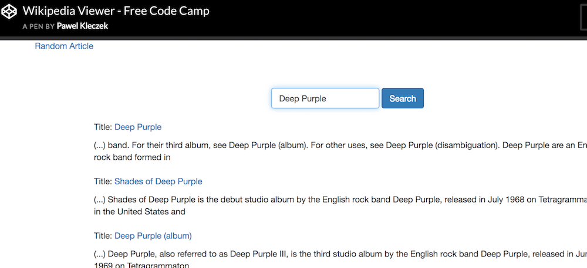

# Wikipedia Viewer API

### FreeCodeCamp challenge
#### by Paweł Kłeczek

Check it out on CodePen:
http://codepen.io/pawelkleczek/full/XpLZOq/

## What is this?

Wikipedia Viewer API is a raw, straightforward tool for search querying Wikipedia for articles. Basically it uses javascript to construct a proper link. Wikipedia API in turn sends articles (that correspond to the query) in JSON format. Then it processes the data, so that user can get a list of articles with links to proper Wikipedia subpages.

